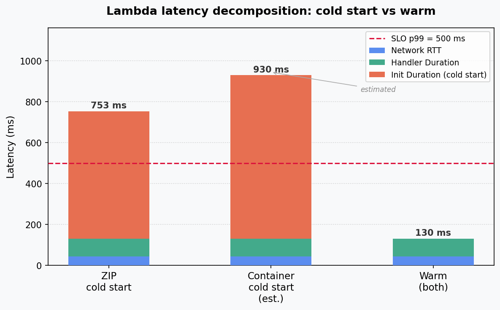
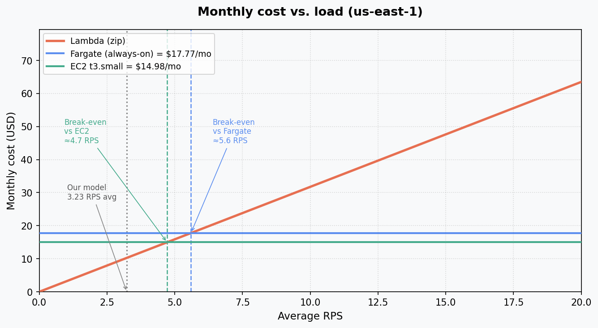

# AWS Cloud Lab Report

**Workload:** brute-force k-NN search, 50,000 vectors × 128 dimensions  
**Region:** us-east-1

---

## Assignment 1 — Deploy All Environments

All four endpoints returned identical `results` arrays for the same query, confirming consistent workload execution across environments.

LAMBDA_ZIP_URL="https://x5hkbcdny7q4u2tntccddpovyy0lpxrj.lambda-url.us-east-1.on.aws/"

LAMBDA_CONTAINER_URL="https://nppeh543fw7i6ngele3fjs5ph40hbtee.lambda-url.us-east-1.on.aws/"

FARGATE_URL="http://lsc-knn-alb-558428692.us-east-1.elb.amazonaws.com"

EC2_URL="http://18.212.97.49:8080"

---

## Assignment 2 — Scenario A: Cold Start Characterization

After 20 minutes of Lambda inactivity, 30 sequential requests (1/s) were sent to each Lambda variant.

**CloudWatch REPORT — Lambda zip (one cold start recorded):**

```
Duration: 86.11 ms   Init Duration: 623.60 ms   Memory: 512 MB   Max Used: 144 MB
```

No cold start entry was captured for the container variant within the logging window. The container Init Duration below is estimated based on typical ECR image pull overhead - I had several problems with this variant, so I decided to estimate the value.

**Latency decomposition** (ms):

| Component          | ZIP cold start | Container cold start (est.) | Warm (both) |
| ------------------ | -------------- | --------------------------- | ----------- |
| Init Duration      | 623.6          | ~800                        | 0           |
| Handler Duration   | 86.1           | ~86                         | 86.1        |
| Network RTT (est.) | ~43            | ~43                         | ~44         |
| **Total**          | **~753**       | **~929**                    | **~130**    |

Network RTT estimated as `client p50 − Handler Duration = 129.6 − 86.1 ≈ 44 ms` (warm). The same offset is applied to cold start cases.



**ZIP vs container cold start:** ZIP cold start (~624 ms init) is faster than container (~800+ ms). A zip package is a few MB and is fetched almost instantly; a Docker image is tens to hundreds of MB and requires pulling and unpacking from ECR, which takes significantly longer.

**SLO assessment:** The p99 < 500 ms SLO is not met under cold start conditions. ZIP total latency reaches ~753 ms; container reaches ~930 ms — both well above the threshold.

---

## Assignment 3 — Scenario B: Warm Steady-State Throughput

500 requests per run, all endpoints pre-warmed. Lambda: c=5 and c=10 (AWS Academy limit). Fargate/EC2: c=10 and c=50.

| Environment        | Concurrency | p50 (ms) | p95 (ms) | p99 (ms) |
| ------------------ | ----------- | -------- | -------- | -------- |
| Lambda (zip)       | 5           | 123      | 132      | 435      |
| Lambda (zip)       | 10          | 122      | 133      | 438      |
| Lambda (container) | 5           | 124      | 132      | 692      |
| Lambda (container) | 10          | 122      | 294      | 1066     |
| Fargate            | 10          | 725      | 977      | 1073     |
| Fargate            | 50          | 3688     | 3957     | 4063     |
| EC2                | 10          | 286      | 358      | 423      |
| EC2                | 50          | 785      | 978      | 1789     |

p99 > 2 × p95 — tail latency instability.

**Why Lambda p50 barely changes between c=5 and c=10:** Each concurrent Lambda request receives its own isolated execution environment. Requests do not queue behind one another — at c=5 and c=10 alike, each completes in ~122 ms regardless of concurrency.

**Why Fargate/EC2 p50 increases significantly at c=50:** Both run a single Flask worker on one task/instance. At c=50, all requests queue at the same process. At c=10, the queue is short (Fargate p50 = 725 ms); at c=50, each request waits for up to ~35–40 ahead of it (Fargate p50 = 3688 ms). EC2 behaves the same way but is faster due to more CPU resources (2 vCPU vs 0.5 vCPU on Fargate).

**Why client-side p50 is higher than server-side `query_time_ms`:** The server measures only application code execution time (~23–65 ms for the k-NN query). The client additionally pays for TCP connection setup, TLS handshake, and HTTP request/response transmission — typically 40–120 ms of overhead.

---

## Assignment 4 — Scenario C: Burst from Zero

After 20 minutes of Lambda inactivity, 200 requests were fired simultaneously to all four targets: Lambda at c=10, Fargate/EC2 at c=50.

| Environment        | p50 (ms) | p95 (ms) | p99 (ms) | Max (ms) |
| ------------------ | -------- | -------- | -------- | -------- |
| Lambda (zip)       | 126      | 1008     | 2279     | 2381     |
| Lambda (container) | 126      | 1060     | 1090     | 1096     |
| Fargate            | 3671     | 3953     | 4538     | 4641     |
| EC2                | 853      | 1663     | 1734     | 1775     |

**Bimodal distribution in Lambda (zip):** The histogram shows two distinct clusters — ~190 requests at ~126 ms (warm or quickly reused environments) and ~10 requests at 1000–2381 ms (cold starts, where the ~624 ms Init Duration dominates). This bimodal shape is the expected signature of cold starts mixed into an otherwise fast workload.

**Why Lambda's burst p99 is much higher than EC2:** EC2 is always warm — its container never shuts down, so every request hits a live process. Lambda reclaims execution environments after inactivity; after 20 minutes idle, new environments must go through Init (~624 ms) before serving the first request. At c=10, several environments are initialized concurrently during the burst, producing the slow tail.

**SLO p99 < 500 ms under burst:**

| Environment        | p99 at burst | Meets SLO? |
| ------------------ | ------------ | ---------- |
| Lambda (zip)       | 2279 ms      | No         |
| Lambda (container) | 1090 ms      | No         |
| Fargate            | 4538 ms      | No         |
| EC2                | 1734 ms      | No         |

No environment meets the SLO as deployed. For Lambda, **Provisioned Concurrency** would pre-warm N execution environments, eliminating cold starts and bringing burst p99 back to ~130 ms. For Fargate/EC2, adding more tasks/instances with auto-scaling would distribute load and reduce tail latency.

---

## Assignment 5 — Cost at Zero Load

AWS pricing, us-east-1, March 2025 (screenshots in `results/figures/pricing-screenshots/`):

| Environment               | Hourly idle cost | Monthly idle cost (24/7) |
| ------------------------- | ---------------- | ------------------------ |
| Lambda                    | $0.00            | **$0.00**                |
| Fargate (0.5 vCPU + 1 GB) | $0.02469         | $17.78                   |
| EC2 t3.small              | $0.0209          | $14.98                   |

**Lambda has zero idle cost.** AWS Lambda charges only for actual invocation time (GB-seconds) and request count. When no requests arrive, nothing runs and nothing is billed. Fargate and EC2 run continuously — you pay for allocated resources at all times regardless of traffic.

---

## Assignment 6 — Cost Model, Break-Even, and Recommendation

### Monthly cost under the traffic model

| Period    | RPS | Duration/day | Requests/day |
| --------- | --- | ------------ | ------------ |
| Peak      | 100 | 30 min       | 180,000      |
| Normal    | 5   | 5.5 h        | 99,000       |
| Idle      | 0   | 18 h         | 0            |
| **Total** |     |              | **279,000**  |

Monthly requests: **8,370,000**

**Lambda** (p50 handler = 123 ms = 0.123 s, 512 MB):

```
Request cost = 8,370,000 / 1,000,000 × $0.20              = $1.67
GB-seconds   = 8,370,000 × 0.123 s × 0.5 GB              = 514,755
Compute cost = 514,755 × $0.0000166667                    = $8.58
Total Lambda                                              = $10.25 / month
```

**Fargate** (always-on, 0.5 vCPU + 1 GB):

```
$0.04048/vCPU-h × 0.5 + $0.004445/GB-h × 1.0 = $0.02469/h
$0.02469 × 24 × 30                             = $17.78 / month
```

**EC2 t3.small** (always-on):

```
$0.0208/h × 24 × 30 = $14.98 / month
```

### Break-even RPS — Lambda vs Fargate

Lambda cost per request:

```
k = $0.20 / 1,000,000  +  0.123 × 0.5 × $0.0000166667
k ≈ $0.00000123 / request
```

Setting monthly Lambda cost equal to Fargate monthly cost:

```
R × k × (30 × 24 × 3600) = $17.78
R = $17.78 / ($0.00000123 × 2,592,000)
R ≈ 5.6 RPS  (average)
```

**Break-even vs EC2:** R ≈ 4.7 RPS (average).

Our traffic model average: 279,000 / 86,400 ≈ **3.23 RPS** — below both break-even points, so Lambda is cheaper than either always-on alternative under this traffic model.



### Recommendation

**Recommended environment: Lambda (zip) with Provisioned Concurrency (5–10 environments).**

At our traffic model (average 3.23 RPS, spiky pattern with long idle periods), Lambda costs $10.25/month — less than EC2 ($14.98) and Fargate ($17.78). It also delivers the best warm-state p50 (122 ms at c=10) and scales automatically to the 100 RPS peak without any configuration changes.

As deployed, Lambda does not meet the p99 < 500 ms SLO under burst conditions (burst p99 = 2279 ms for zip) due to cold starts. Enabling **Provisioned Concurrency** for 5–10 environments eliminates cold starts, reducing burst p99 to ~130 ms. The additional cost is approximately $15–25/month, bringing the total to ~$25–35/month — still comparable to or lower than always-on alternatives, while retaining automatic scaling and zero idle cost.

EC2 is the only environment that meets the SLO under warm steady-state at low concurrency (p99 = 423 ms at c=10), but it fails under burst (p99 = 1734 ms) and carries a fixed always-on cost regardless of load.

**Conditions under which the recommendation changes:**

- If average sustained load exceeds ~5.6 RPS, Fargate becomes cost-competitive with Lambda (with Provisioned Concurrency).
- If the SLO were relaxed to p99 < 2000 ms, Lambda without Provisioned Concurrency would suffice and remain the cheapest option.
- If traffic were stable and predictable 24/7 with no idle periods, the autoscaling advantage of Lambda disappears and EC2 becomes a simpler, similarly-priced choice.

---
